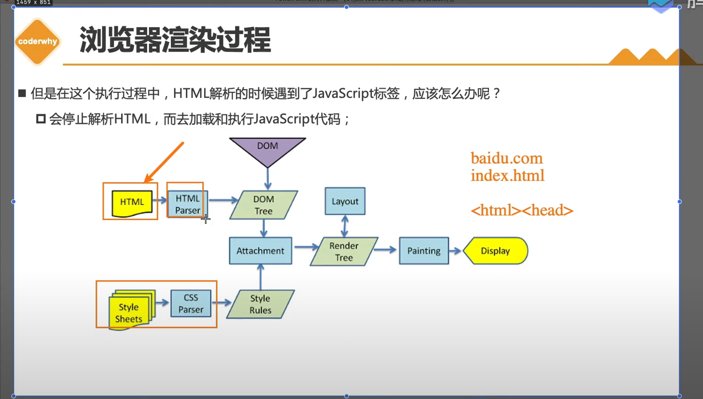

#### 从浏览器导航栏输入网址都做了什么
```
我们在浏览器上输入网站之后都做了什么操作呢？
1.dns将网站解析成ip地址，然后通过ip地址去下载相应的静态资源 比如 index.html||mian.html
然后在解析index.html时候 又会遇见 很多 <link></link>
<script></script>
然后在再去服务器去下载这些css文件跟js文件
那最终是怎么在浏览器上呈现出网页呢？
```

```
HTML会通过 HTMLParser转换成 DOM Tree,
CSS 也会通过 CSSParser转换成 StyleRules,
```