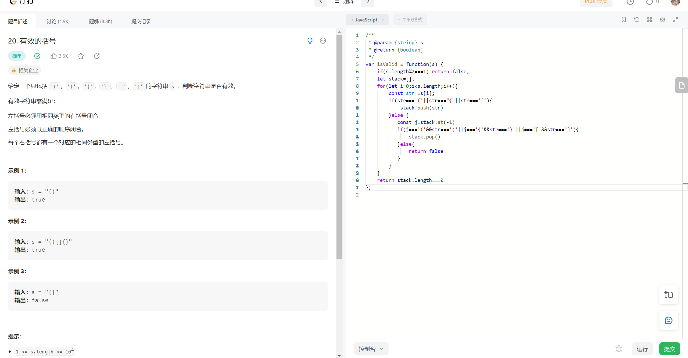

##### 模拟一个栈，因为 js 中不存在栈，我们可以使用 Arrary 中的方法模拟一个栈,

##### 遵循后进先出的规律

##### 以为 vscode 是支持 node 环境，所以我们可以直接点某一行代码，按 F5

`const stack=[]; `
`stack.push(1); `
`stack.push(2); `
`let item=stack.pop() `
`let item2=stack.pop()`

##### 栈遵循后进先出的规律，函数调用堆栈使用场景

##### 最后执行的函数先执行完

- 1 解题思路，根据栈的先进后出的原理，还有这道题的考察就符合我们先进后出，我们遇到(,{,[这三种我们先进栈，当进完之后我们从最后一位开始匹配剩下的字符，剩下的字符则就是),},]遇见闭合则我们删除入栈的最后一位，不匹配则跳出
